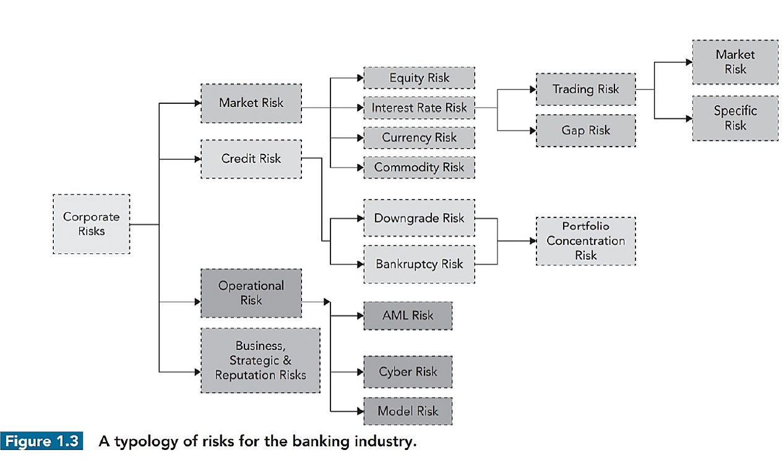
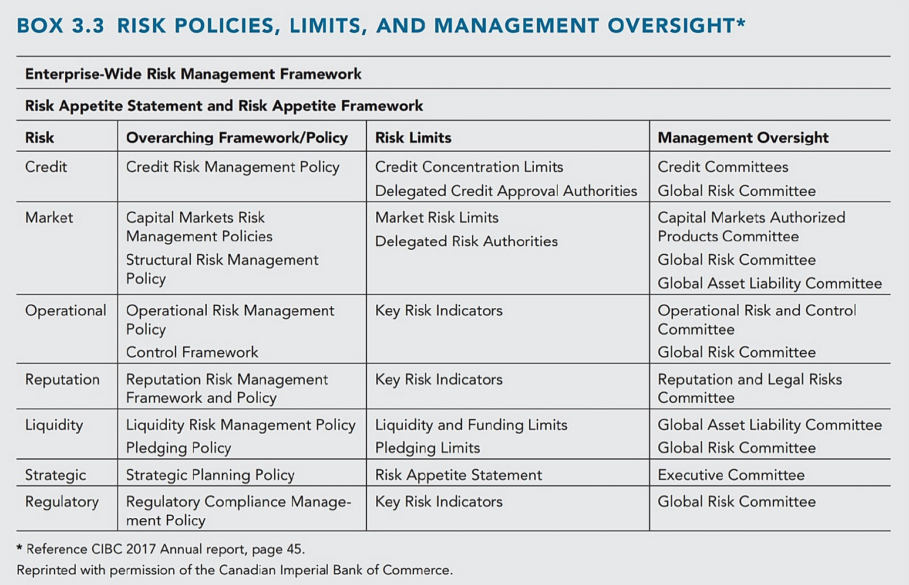
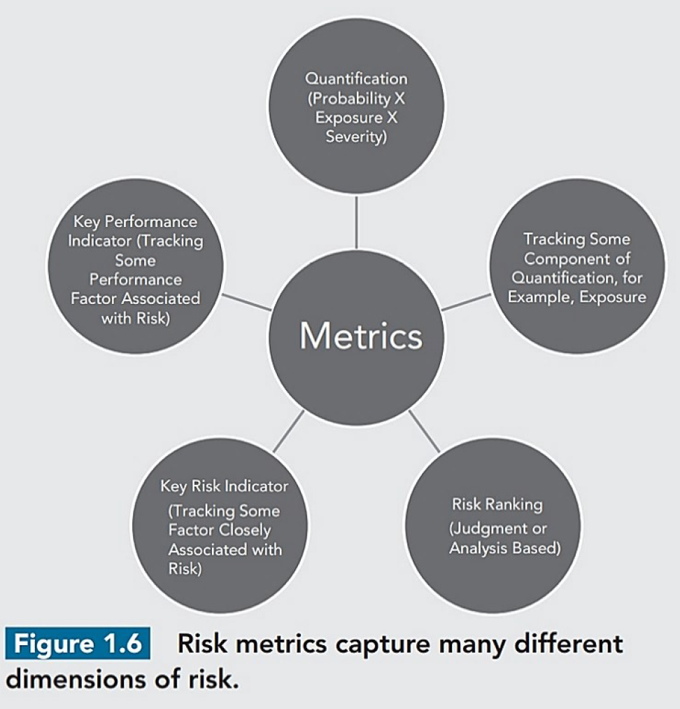
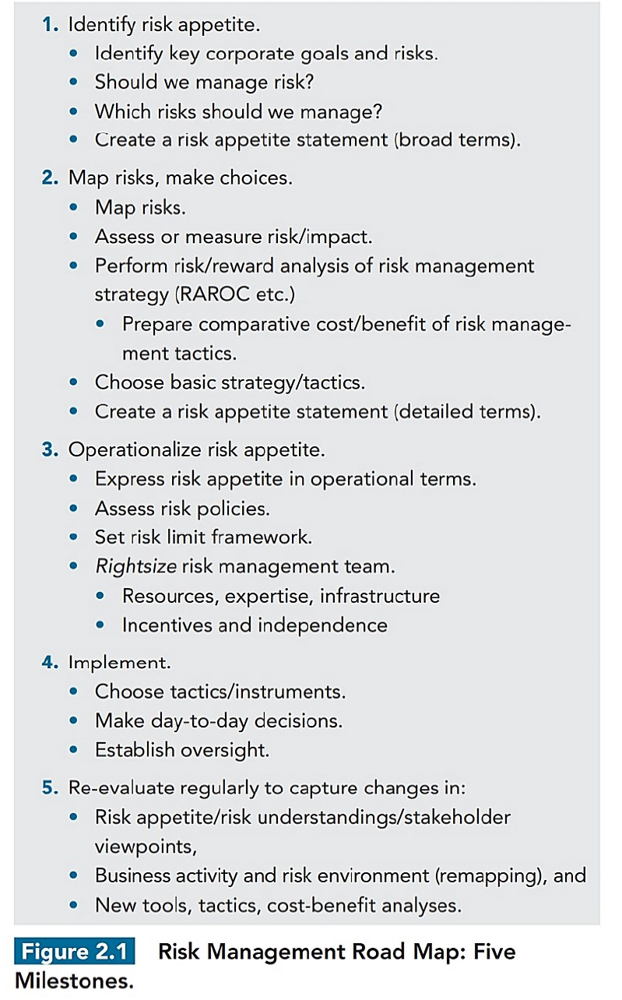
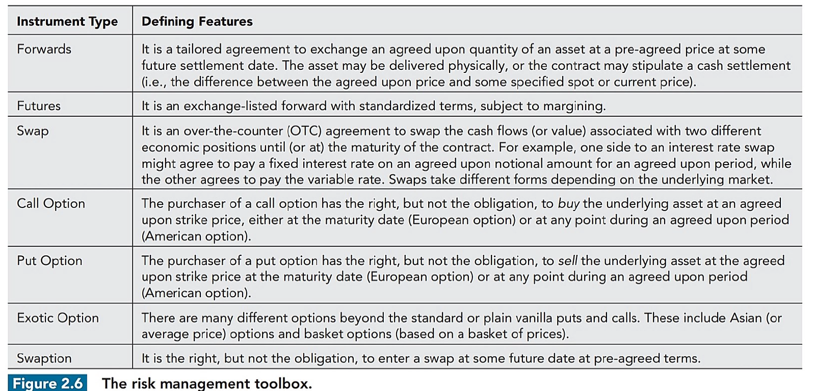
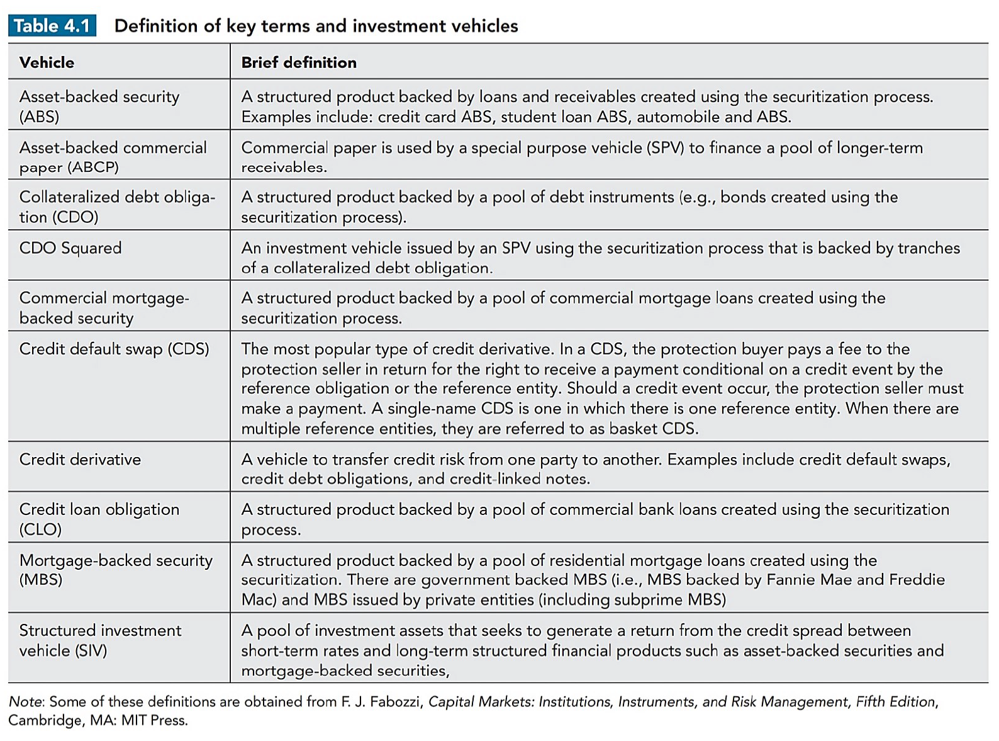

# Financial Risk Management (FRM) <!-- markmap: foldAll -->

## Sources 
### Overview
- 
- 
### Market Risk
#### Interest Rate Risk
#### Derivatives Risk
### Credit Risk
### Operational Risk
### Liquidity Risk
## Metrics
### Overview
- 
### Value at Risk (VaR)
### Expected Shortfall (ES)
### Risk Matrix
## Procedure / Roadmap
### Overview
- 
## Quantitative Methodologies
### Machine Learning
#### Supervised Learning
##### Regression
###### Linear Regression
- 特點: 用於預測連續變量，假設輸入變量和輸出變量之間有線性關係。模型簡單且易於解釋。
- 應用情境: 預測房價、股票價格、銷售額等。
##### Classification
###### Logistic Regression
- 特點: 用於二分類問題，預測某個事件發生的概率。輸出為0到1之間的概率值。
- 應用情境: 銀行信用評分、醫療診斷、電子郵件垃圾分類等。
###### Support Vector Machines (SVM)
- 特點: 用於分類問題，尋找能夠最大化類別間隔的決策邊界。可以通過核函數處理非線性分類問題。
- 應用情境: 圖像分類、文本分類、手寫字識別。
##### K-Nearest Neighbors (KNN)
- 特點: 非參數模型，基於距離度量進行分類或迴歸。簡單但在高維度數據上可能不太有效。
- 應用情境: 圖像識別、推薦系統、異常檢測。
#### Unsupervised Learning
##### Decision Trees
- 特點: 基於樹狀結構進行分類或迴歸，易於解釋，能夠處理非線性關係。可能會過擬合，需要剪枝或使用集成方法。
- 應用情境: 客戶細分、信用風險評估、醫療診斷。
##### KMeans
- 特點: 無監督學習演算法，將數據劃分為K個聚類，最小化每個點到其所在聚類中心的距離。適合於資料探索。
- 應用情境: 市場細分、圖像壓縮、客戶分群。
##### Principal Component Analysis (PCA)
- 特點: 用於降維，將高維數據投影到低維空間，保留最有價值的數據變異。減少資料冗餘。
- 應用情境: 資料視覺化、資料壓縮、降噪。
#### [Ensemble Learning](https://scikit-learn.org/stable/modules/ensemble.html)
##### Random Forest
- 特點: 集成多棵決策樹的結果來提高預測精度，並且能有效減少過擬合。適合處理高維數據。
- 應用情境: 風險管理、推薦系統、基因表達分析。
##### Gradient Boosting Machines (GBM)
- 特點: 集成多個弱分類器（如決策樹），通過逐步修正誤差來提高模型性能。具有高準確率，但訓練時間較長。
- 應用情境: 排名任務（如搜索引擎）、保險欺詐檢測、醫療預測。
##### XGBoost
#### Reinforcement Learning
### Deep Learning
#### [Convolutional Neural Network (CNN)](https://stanford.edu/~shervine/teaching/cs-230/cheatsheet-convolutional-neural-networks)
#### [Recurrent Neural Networks (RNN)](https://stanford.edu/~shervine/teaching/cs-230/cheatsheet-recurrent-neural-networks)
##### Long Short-Term Memory (LSTM)
- 特點: 一種特殊的遞歸神經網絡 (RNN)，能夠捕捉長期依賴性，適合處理序列數據。
- 應用情境: 自然語言處理 (NLP)、語音識別、時間序列預測。
### Large Language Models
## Risk Transfer Instruments
### Overview
- 
### Forwards
- 定義：一種非標準化合約，雙方約定在未來某一日期以特定價格買賣某資產。
- 目的：用於對沖風險，固定未來的成本或收益。
- 案例：企業用來鎖定原料未來購買價格，防範價格波動帶來的風險。
### Futures
- 定義：標準化的合約，約定未來某日期以特定價格買賣資產，通常在交易所交易。
- 目的：提供市場透明度和流動性，同時降低交易對手風險。
- 案例：農民使用小麥期貨來對沖即將來臨的收成期間價格下跌的風險。
### Swaps
- 定義：兩方交換其金融工具的現金流，如利率掉期或貨幣掉期。
- 目的：管理或改變利率或匯率風險的曝露。
- 案例：銀行之間進行利率掉期，以對沖不同貸款和存款之間的利率變動風險。
### Options
#### Pricing
#### Sensitivity Analysis: Greeks
##### Delta: $\Delta = \dfrac{\partial F}{\partial S}$ where $F$ is the option price with the underlying asset price $S$.
- 標的物價格變動時，選擇權的價格對其的敏感度，是最先會被觀察的風險指標。
##### Gamma
##### Vega: $\nu = \dfrac{\partial F}{\partial \sigma}$ where $\sigma$ is the volatility of the underlying asset.
- 當市場有劇烈波動時，選擇權會變得比較昂貴。
##### Theta: $\theta = \dfrac{\partial F}{\partial T}$ where $T$ is the time to maturity.
- 時間價值：選擇權的價值來自於*內含價值*與*時間價值*，故隨著時間流逝，選擇權的時間價值會消失。
##### Rho: $\rho = \dfrac{\partial F}{\partial r}$ where $r$ is the risk-free rate.
- 利率變動對選擇權的影響。
### Credit-related Instruments
#### Overview
- 
#### Credit Default Swap (CDS)
- 定義：一種保險合約，保護買方免受特定信用工具違約的損失。
- 目的：作為風險管理工具，保障貸款人和債權人的資產。
- 案例：銀行購買 CDS 以對沖其放貸組合中潛在的違約風險。